<div align="center">

```text
██████████████████████████████████████████████████████████████████████

      █████╗ ██╗     ██████╗ ███████╗
     ██╔══██╗██║    ██╔═══██╗██╔════╝
     ███████║██║    ██║   ██║███████╗
     ██╔══██║██║    ██║   ██║╚════██║
     ██║  ██║██║    ╚██████╔╝███████║
     ╚═╝  ╚═╝╚═╝     ╚═════╝ ╚══════╝

            Artificial Intelligence Operating System

██████████████████████████████████████████████████████████████████████
```


<a href="https://linkedin.com/in/bhuvan-madhusudhan-623108145">
  
</a>
<a href="https://github.com/Bhuvanlord0602">
  
</a>
<a href="https://leetcode.com/u/79N4xG51Sc">
  
</a>


</div>

---

<div align="center">


</div>

<sub align="center">↑ this loops on its own — real progress bars filling, blinking cursor, no click needed</sub>

---

<div align="center">

[](https://git.io/typing-svg)

</div>

<div align="center">


</div>

---

<div align="center">


</div>

---

<div align="center">


</div>

---

# root@bhuvan-ai:~$ ls modules --skillicons

<div align="center">


</div>

---

<div align="center">


</div>

---

# root@bhuvan-ai:~$ pwd

```text
/home/bhuvan/building/the-future-with-ai
```

---

# root@bhuvan-ai:~$ echo $MISSION

```text
"Build intelligent software that makes people's lives easier."

```

---

# root@bhuvan-ai:~$ cat currently_learning.md

```text

✓ Agentic AI

✓ LangGraph

✓ CrewAI

✓ OpenAI APIs

✓ Ollama

✓ RAG Pipelines

✓ Vector Databases

✓ Kubernetes

✓ MLOps

```

---

# root@bhuvan-ai:~$ github-stats --live

<div align="center">


</div>

> Note: stats cards refresh live from GitHub each time this page loads — if any show "0" it usually just means the linked repos/activity need to be public.

---

<div align="center">


</div>

---

<div align="center">


</div>

---

<div align="center">


</div>

---

<div align="center">


</div>

---

<div align="center">


</div>

---

<div align="center">


</div>

---

<div align="center">


</div>

---

<div align="center">


</div>

---

<div align="center">


</div>

---

<div align="center">


</div>

---

# root@bhuvan-ai:~$ trophy --live

<div align="center">


</div>

---

<div align="center">


</div>

---

<div align="center">


</div>

---

<div align="center">


</div>

---

<div align="center">


</div>

---

<div align="center">


</div>

---

<div align="center">


</div>

---

<div align="center">


</div>

---

<div align="center">


</div>

---

<div align="center">


</div>

---

<div align="center">


</div>

---

<div align="center">


</div>

---

# root@bhuvan-ai:~$ ssh future

```text
Connecting to Future...

Authenticating...

█████████████████████████████████████

Authentication Successful

Welcome to

2030

AI Operating System

```

---

<div align="center">


</div>

---

<div align="center">


</div>

---

<div align="center">


</div>

---

<div align="center">


</div>

---

<div align="center">


</div>

---

<div align="center">


</div>

---

<div align="center">


</div>

---

<div align="center">


</div>

---

<div align="center">


</div>

---

# root@future-ai:~$ contribution-graph --animate

<div align="center">


</div>

> This animated snake graph auto-generates from your GitHub contributions once you add the companion GitHub Action to your repo — I've included the setup steps below.

---

# root@future-ai:~$ exit

```text
Saving Session...

Syncing Projects...

Uploading Commits...

Closing Terminal...

Connection Closed.

Thanks for visiting.

See you in the next commit.

root@bhuvan-ai:~$
```

<div align="center">


</div>
